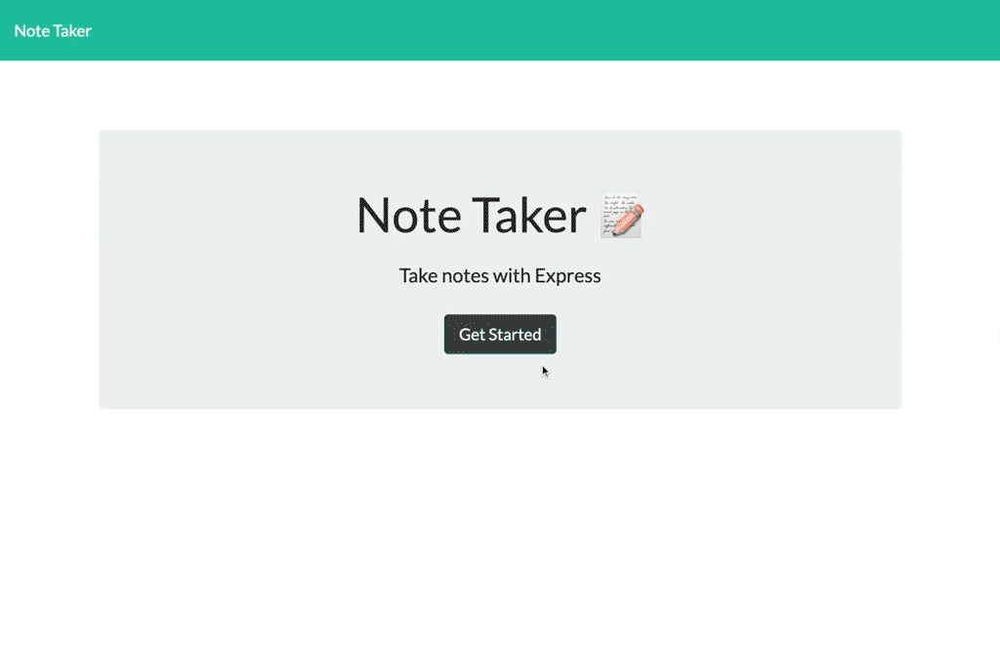

# Note Taker

## Table of Contents
* [Description](#description)
* [Built with](#built-with)
* [Screenshot](#screenshot)
* [Contributing](#contributing)
* [Links](#links)
  
## Description
A website for writing, saving and deleting notes.

## Built with:
* HTML, CSS, and Javascript on the front end
* Node.js, using Express.js and uuid packages on the back end.
* Data saved in JSON format.

## How to use:
1. Click on the "Get Started" button on the home page.
2. To review your notes:
    1. Click on the title from the list of notes in the left column. 
    2. The full note will appear in the column on the right
3. To add a new note:
    1. Click on the "New Note" icon (looks like a pencil) in the top right corner of the navigation bar. 
    2. Enter the title and contents of your note in the form in the right column. 
    3. A "Save" icon (looks like a floppy disk) will appear next the "New Note" icon. Click on it and your note will be saved and added to the list of notes in the left column.
4. To delete a note, click the "Delete" icon (looks like a trash can) next to the note you want to delete in the left column.

## Links
* [Website](https://immense-river-11904.herokuapp.com/)
* [GitHub](https://github.com/e-p-n/note-taker)

